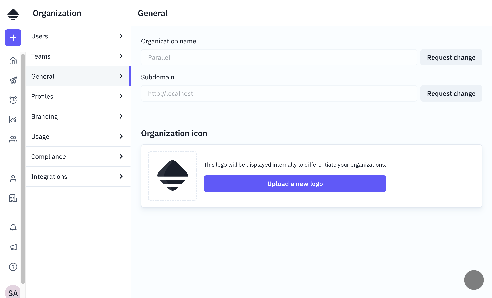

# Organization

Documentation of organization configuration-related tables and their user interface.

---

## 1. Main table: `organization`

The `organization` table is the root entity of the multi-tenant system. Each organization has its own users, petitions, profiles, and configurations.

It stores the organization's basic information (name, custom host, logo), usage limits, preferences, and GDPR settings like petition anonymization periods.

### Organization Status

| Status     | Description                                 |
| ---------- | ------------------------------------------- |
| `DEV`      | Development organization                    |
| `DEMO`     | Demo organization                           |
| `ACTIVE`   | Active production organization              |
| `CHURNED`  | Organization that has left the platform     |
| `ROOT`     | Root organization (platform administration) |
| `INACTIVE` | Deactivated organization                    |

### Frontend view - General settings

The "Organization > General" section allows configuring:

- Organization name
- Subdomain
- Logo and icon



---

## 2. Related tables

### `organization_theme`

Stores visual customization themes for the organization. Supports different theme types like PDF document styling and brand colors.

### `organization_usage_limit`

Tracks usage limits per organization (quotas). Each limit has a name, maximum allowed value, current usage, and renewal period.

### `org_integration`

Manages external service integrations. Each integration has a type, provider, and settings. Common integration types include electronic signature, SSO, user provisioning (SCIM), KYC/AML, AI completion, ID verification, document processing, and file export.

### `feature_flag`

Controls feature availability per organization. Allows enabling or disabling specific features for individual organizations.

---

## 3. User groups

### `user_group`

Groups to organize users and assign permissions. Special group types include `ALL_USERS` (automatic group with all users) and `INITIAL` (group automatically created on organization creation).

### `user_group_permission`

Permissions assigned to groups. Each permission has a name and an effect (`GRANT` or `DENY`).

**Note:** The `SUPERADMIN` permission grants access to other organizations for support purposes and is only available on the ROOT organization.

### `user_group_member`

Junction table that links users to groups.

---

## 4. Configuration sections

The Organization interface includes the following sections:

| Section      | Description                              |
| ------------ | ---------------------------------------- |
| Users        | User management                          |
| Teams        | User groups                              |
| General      | Name, subdomain, logo                    |
| Profiles     | Profile types configuration              |
| Branding     | Visual customization for emails and PDFs |
| Usage        | Usage and limits                         |
| Compliance   | Compliance settings                      |
| Integrations | External integrations                    |

---

## 5. GraphQL API

The organization module exposes queries for fetching organization data, themes, usage limits, and integrations. Mutations are available for updating organization settings, creating themes, and managing integrations.

See `server/src/graphql/organization/` for implementation details.

---

## 6. Multi-Tenancy

The `org_id` field is the main segregation key in almost all system tables:

```
organization
├── user (org_id)
├── petition (org_id)
├── profile (org_id)
├── contact (org_id)
├── user_group (org_id)
├── organization_theme (org_id)
├── organization_usage_limit (org_id)
└── org_integration (org_id)
```

All queries automatically include the `org_id` filter to ensure data isolation between organizations.

---

## 7. Organization preferences

The `preferences` field (JSONB) stores dynamic configurations that can vary per organization. Check the codebase for current preference options.
