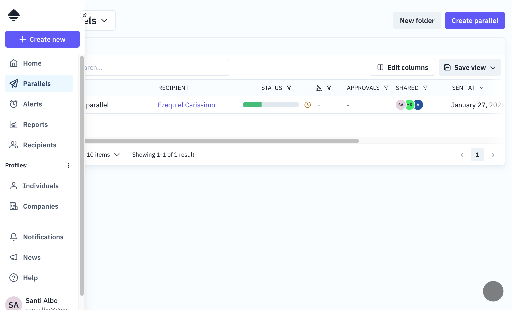

# Petitions (Parallels)

Documentation of petition-related tables and their user interface.

---

## 1. Main table: `petition`

The `petition` table is one of the core entities of the system. It represents cases, files, or requests sent to recipients to collect information.

A petition contains configuration for deadlines, email content, reminders, electronic signatures, review flows, and document generation. Petitions can be templates (reusable) or regular petitions.

### Frontend view - Petition list

The "Parallels" section displays a table with all petitions, allowing:

- Search by name
- Filter by status, electronic signature, approvals, etc.
- Saved custom views
- Configurable pagination



### Frontend view - Petition detail

The petition detail shows:

- Tabs: Compose, Input, Review, Activity
- Field list with their responses
- Side panel with content and comments
- Actions: Close, Export responses, Export PDF


---

## 2. Related tables

### `petition_field`

Defines the fields/questions of a petition. Each field has a type (text, file upload, select, date, etc.), position, title, description, and various configuration options like visibility conditions and approval requirements.

### `petition_access`

Manages recipient access to petitions. Stores the unique access code (keycode), reminder configuration, and access status for each recipient.

### `petition_permission`

Defines user permissions on petitions. Users can have different permission levels (owner, write, read) and can subscribe to notifications.

### `petition_field_reply`

Stores responses to petition fields. Each reply is linked to a petition access and field, with a value and approval status.

### `petition_field_comment`

Comments and internal notes on petition fields. Internal notes are only visible to internal users, while comments are visible to all.

### `petition_attachment`

Petition attachments (documents). Each attachment has a type (front, annex, back) and position.

### `petition_event`

Petition audit events. Records all significant events like creation, sending, completion, field replies, and profile associations.

---

## 3. Approval flow

### `petition_approval_request_step`

Defines the steps in an approval flow. Each step has a number, name, status, and approval type (any approver or all approvers must approve).

### `petition_approval_request_step_approver`

Links approvers to approval steps and tracks their approval/rejection status.

---

## 4. Relationship with profiles

The relationship between petitions and profiles is **many-to-many** through the `petition_profile` junction table. A petition can have multiple profiles associated, and a profile can be linked to multiple petitions.

---

## 5. GraphQL API

The petition module exposes queries for fetching individual petitions and paginated lists with filters. Mutations are available for creating, updating, sending, closing, and deleting petitions.

See `server/src/graphql/petition/` for implementation details.

---

## 6. Petition statuses

```
DRAFT ──> PENDING ──> COMPLETED ──> CLOSED
  │           │
  └───────────└────────────────────> CLOSED
```

| Status      | Description                      |
| ----------- | -------------------------------- |
| `DRAFT`     | Draft, not sent                  |
| `PENDING`   | Sent, waiting for responses      |
| `COMPLETED` | All responses received           |
| `CLOSED`    | Closed manually or automatically |
