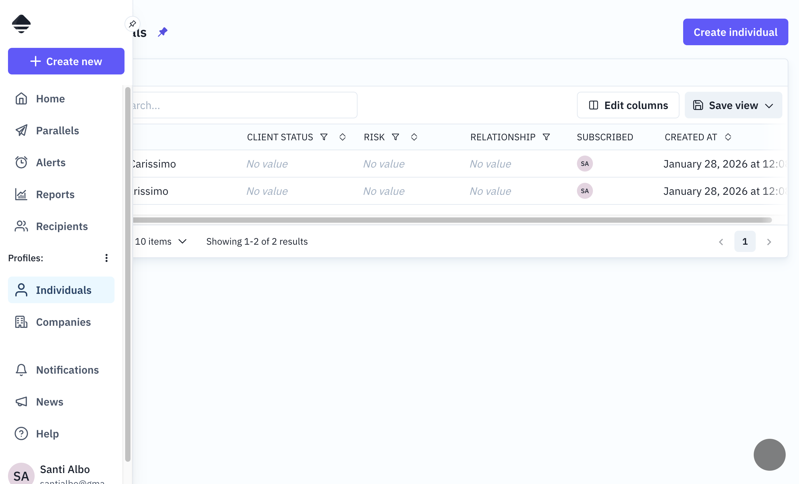
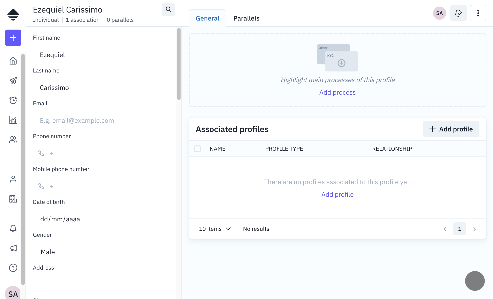
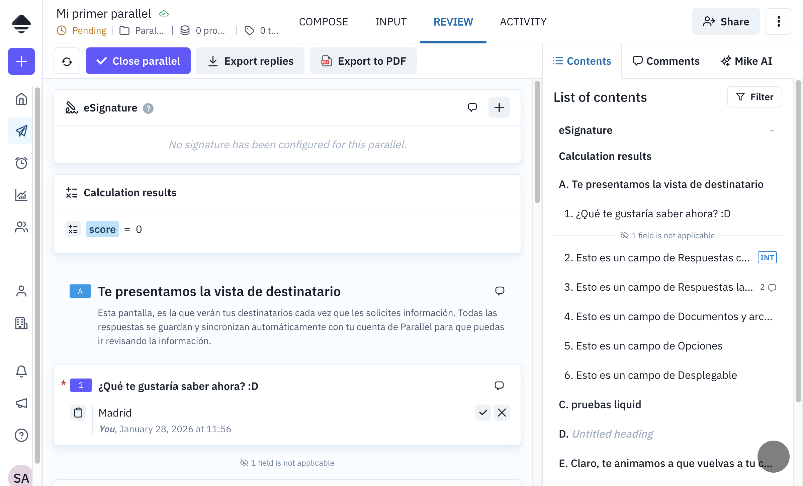

# Profiles

Documentation of the profile system - a flexible entity management system with customizable schemas.

---

## 1. Main table: `profile`

The `profile` table is a **flexible entity system** that allows organizations to define and manage any type of structured data. Each profile belongs to a `profile_type` that defines its schema (fields, permissions, validation rules).

This is one of the core entities of the system. Common use cases include managing people, companies, contracts, or any custom object type the organization needs.

### Profile Types

Organizations can define **any custom profile types** with their own field configurations. By default, new organizations are created with two profile types:

| Default Type   | Common Use                  |
| -------------- | --------------------------- |
| `INDIVIDUAL`   | People (natural persons)    |
| `LEGAL_ENTITY` | Companies and organizations |

Additional standard types can be added if needed:

| Optional Type | Common Use             |
| ------------- | ---------------------- |
| `CONTRACT`    | Contract records       |
| `MATTER`      | Legal matters or cases |

The standard types come with predefined fields that can be extended with additional custom fields. Organizations can also create **entirely new profile types from scratch**, defining their own schema for entities like "Projects", "Assets", "Suppliers", "Vehicles", or any other entity type relevant to their business.

Each profile type defines:

- **Custom fields**: Text, numbers, dates, file uploads, selects, etc.
- **Field permissions**: Which fields are visible/editable
- **Monitoring**: Background checks and adverse media searches on specific fields
- **Relationships**: How profiles of this type can relate to other profiles

### Related tables

| Table                  | Description                                                             |
| ---------------------- | ----------------------------------------------------------------------- |
| `profile`              | Master table with basic data and `value_cache` (JSON cache for queries) |
| `profile_type`         | Defines profile types available in the organization                     |
| `profile_type_field`   | Defines the fields/schema for each profile type                         |
| `profile_field_value`  | Stores custom field values for the profile                              |
| `profile_relationship` | Defines relationships between profiles (e.g., family member, employer)  |
| `profile_list_view`    | Saves custom views for the profile table                                |
| `profile_event`        | Profile event traceability and audit                                    |

### Field Permissions

Each profile type field has a permission level that controls visibility and editability:

| Permission | Description                             |
| ---------- | --------------------------------------- |
| `HIDDEN`   | System-only field, not visible to users |
| `READ`     | Visible to users but not editable       |
| `WRITE`    | Visible and editable by users           |

### Profile data storage

Profile data is stored in two places:

1. **`profile_field_value`**: Individual values for each custom field
2. **`profile.value_cache`**: JSON cache automatically updated for optimized queries

### Frontend view

Each profile type appears as a separate section in the navigation menu. The list view displays profiles in a table, allowing:

- Search and filtering
- Filter by status (Open/Closed)
- Custom views (saved in `profile_list_view`)
- Configurable columns and pagination



### Profile detail view

The profile detail shows:

- All fields defined for the profile type (editable based on permissions)
- Associated profiles (relationships)
- Related petitions
- Activity history



---

## 2. Comments and internal notes

**Table:** `petition_field_comment`

Comments and internal notes share the same table, differentiated by the `is_internal` property:

- **Comment** (`is_internal: false`): Visible to all users
- **Internal note** (`is_internal: true`): Only visible to internal users

In the interface, comments and notes are displayed in the side panel of a petition, within the "Comments" tab.



---

## 3. Relationship between petitions and profiles

**Junction table:** `petition_profile`

Petitions and profiles have a **many-to-many** relationship:

- A petition can have **multiple profiles** associated
- A profile can be associated with **multiple petitions**

### Audit events

When a profile is associated or deassociated from a petition, events are generated in both `profile_event` and `petition_event` tables, allowing complete traceability from both entities.

---

## 3. GraphQL API

The profile module exposes queries for fetching profiles with pagination and filters. Mutations are available for creating, updating, and managing profile data and relationships.

See `server/src/graphql/profile/` for implementation details.

---

## 4. Relationship diagram

```
┌───────────────────┐
│   profile_type    │ (defines the schema)
└─────────┬─────────┘
          │ 1:N
          v
┌───────────────────┐       ┌─────────────────────┐
│ profile_type_field│       │      profile        │
│(field definitions)│<──────│ (actual records)    │
└───────────────────┘       └──────────┬──────────┘
                                       │
          ┌────────────────────────────┼────────────────────────────┐
          │                            │                            │
          v                            v                            v
┌─────────────────────┐    ┌─────────────────────┐    ┌─────────────────────┐
│ profile_field_value │    │ profile_relationship│    │   petition_profile  │
│ (field data)        │    │ (links to others)   │    │ (links to petitions)│
└─────────────────────┘    └─────────────────────┘    └─────────────────────┘
```

---

## 5. Monitoring

Profiles support compliance monitoring through special field types:

- **Background Checks**: Uses Open Sanctions to search for people/companies in sanctions lists. Results stored in profile field values.
- **Adverse Media**: Searches for negative news/media mentions. Monitors for changes over time.

Dedicated workers (`background-check-monitor`, `adverse-media-monitor`) watch for changes and alert when new matches appear.

---

## 6. Additional notes

- All main tables use **soft delete** through the `deleted_at` field
- Profile statuses are: `OPEN`, `CLOSED` or `DELETION_SCHEDULED`
- List views allow saving custom filters and columns
- The `value_cache` in the `profile` table is automatically updated to optimize queries
