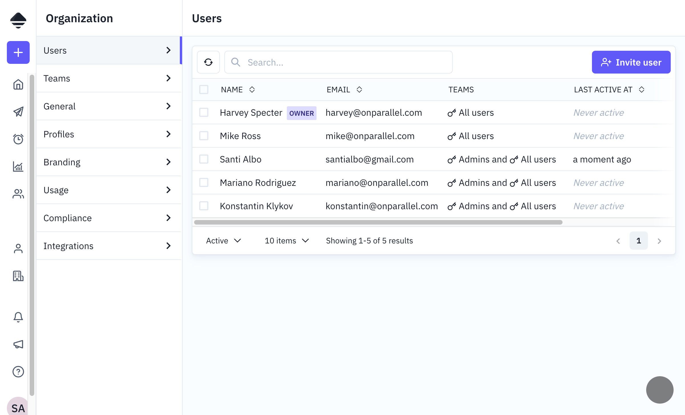

# Users

Documentation of user-related tables and their user interface.

---

## 1. Main table: `user`

The `user` table represents internal system users (organization employees), not external recipients.

Each user belongs to an organization and has a status, preferences, and optional external ID for SSO integration.

### Frontend view - User list

The "Organization > Users" section allows:
- View all organization users
- Search by name or email
- Filter by status (Active/Inactive)
- Invite new users
- View assigned teams



---

## 2. Table: `user_data`

User authentication and profile data shared between organizations. This table stores Cognito ID, email, name, avatar, and preferred locale.

**Note:** A `user_data` can be associated with multiple `user` records (a user can belong to multiple organizations).

---

## 3. Related tables

### `user_authentication_token`

API tokens for programmatic access. Tokens are stored hashed with only a hint visible for identification.

### `user_delegate`

User delegation - allows one user to act on behalf of another.

### `user_group_member`

User membership in groups. Links users to user groups for permission management.

---

## 4. User statuses

| Status     | Description                        |
|------------|------------------------------------|
| `ACTIVE`   | Active user, can access the system |
| `INACTIVE` | Deactivated user, cannot access    |
| `ON_HOLD`  | User on hold (pending invitation)  |

```
ON_HOLD ──> ACTIVE ──> INACTIVE
              │            │
              └────────────┘
```

---

## 5. User preferences

The `preferences` field (JSONB) stores personal settings like dashboard tab order. Check the codebase for current preference options.

---

## 6. Permissions and roles

Permissions are assigned through groups (`user_group`):

```
user
  └── user_group_member
        └── user_group
              └── user_group_permission
```

**Permission verification flow:**
1. Get user groups
2. Get permissions from each group
3. Apply `GRANT` / `DENY` rules
4. `DENY` takes precedence over `GRANT`

---

## 7. Authentication

The system uses AWS Cognito for authentication:

1. **Standard login:** Email + password
2. **SSO:** SAML 2.0 with external providers
3. **API Tokens:** For programmatic access

### Login flow

```
User → /api/auth/login → Cognito → JWT → Session Cookie
```

### SSO flow

```
User → /api/auth/sso → IdP → SAML Response → Cognito → JWT
```

---

## 8. GraphQL API

The user module exposes queries for fetching the current user, individual users, paginated user lists, and user groups. Mutations are available for inviting, updating, deactivating, and managing users and groups.

See `server/src/graphql/users/` for implementation details.

---

## 9. Relationship diagram

```
┌─────────────────┐
│   user_data     │
│  (cognito_id,   │
│   email, name)  │
└────────┬────────┘
         │ 1:N
         ▼
┌─────────────────┐       ┌─────────────────────────┐
│      user       │───────│ user_authentication_token│
│  (org_id,       │ 1:N   │                         │
│   status)       │       └─────────────────────────┘
└────────┬────────┘
         │ N:M
         ▼
┌───────────────────┐     ┌──────────────────────┐
│ user_group_member │─────│     user_group       │
│                   │ N:1 │  (name, type)        │
└───────────────────┘     └──────────┬───────────┘
                                     │ 1:N
                                     ▼
                          ┌──────────────────────┐
                          │ user_group_permission│
                          │  (name, effect)      │
                          └──────────────────────┘
```

---

## 10. Security considerations

- Passwords are never stored in the database (managed by Cognito)
- API tokens are stored hashed
- Inactive users cannot authenticate
- The `is_org_owner` field can only be modified by superadmins
- All actions are recorded in audit logs
